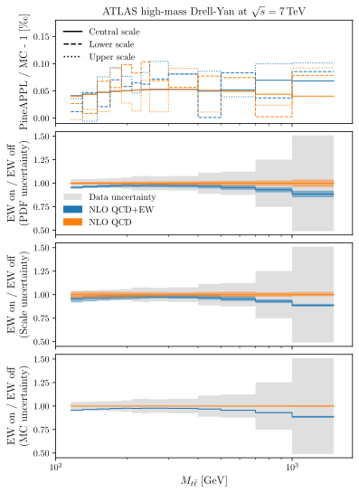
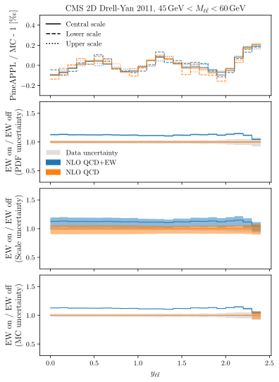
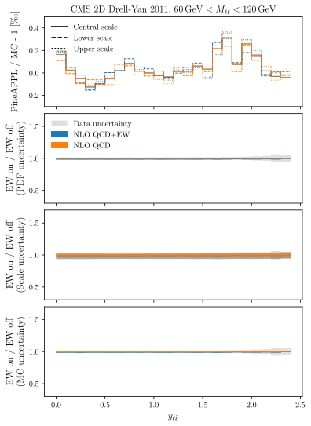
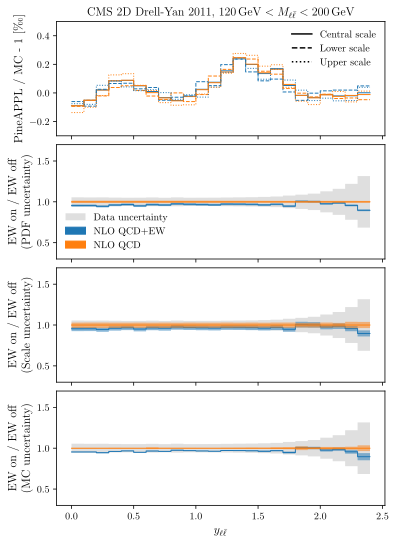
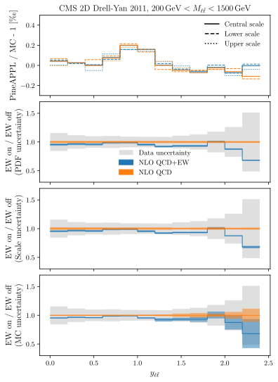
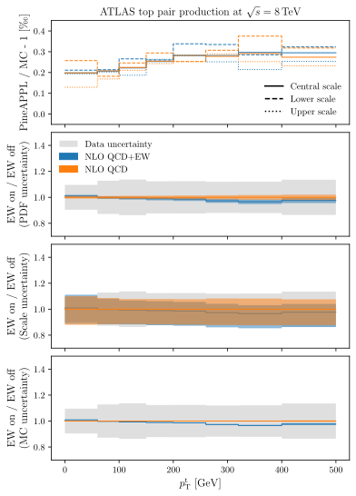
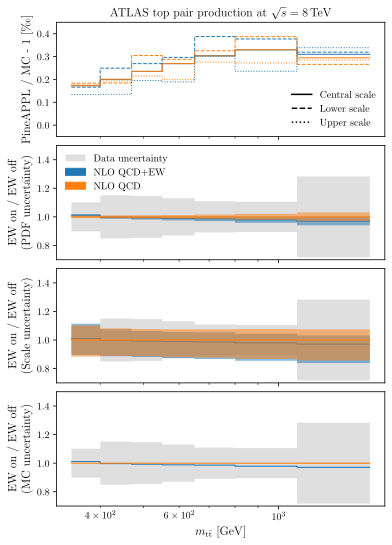
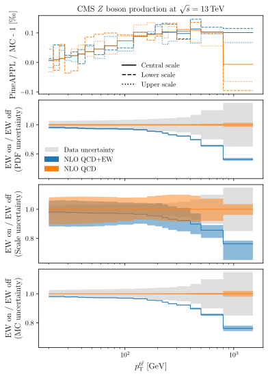

# Welcome to PineAPPL

**PineAPPL** is a computer library that makes it possible to produce fast-interpolation grids for fitting parton distribution functions (PDFs) including corrections of strong and electroweak origin.

## How to download and install PineAPPL?

`PineAPPL` depends on [`Rust`](https://www.rust-lang.org/). If it's already
installed make sure that you have a recent version, otherwise the following
steps might break during compilations. If it's not installed yet, use your
favourite package manager to install it, or go to
<https://www.rust-lang.org/tools/install> and follow the instructions there.

Proceed by installing `cargo-c`, which is required by `pineappl_capi`:

    cargo install cargo-c

Next, install `pineappl_capi`:

    cd pineappl_capi
    cargo cinstall --release --prefix=${prefix}
    cd ..

and finally the command-line program:

    cargo install --path pineappl_cli

Make sure that all the required environment variables are set. See the
`README.md` of `pineappl_capi` for further instructions.

For the python interface please refer to the dedicated documentation
in [pineappl.readthedocs.io](https://pineappl.readthedocs.io/).

## Links to all the supporting documentation

- [Rust API documentation](https://docs.rs/pineappl)
- [C API reference](https://docs.rs/pineappl_capi/0.2.0/pineappl_capi/)
- [Python API](https://pineappl.readthedocs.io/)

## How to cite PineAPPL?

If you use the package please cite the following [Zenodo](https://zenodo.org/) and [arXiv](https://arxiv.org/) references:
- [10.5281/zenodo.3890291](https://doi.org/10.5281/zenodo.3890291)
- [arXiv:2008.12789](https://arxiv.org/abs/2008.12789)

## Links to the grids in the paper

The PineAPPL grids generated for the paper are available in a [dedicated git lfs repository](https://github.com/N3PDF/pineapplgrids). This repository contains the following relevant grids:

### ATLAS high-mass Drell-Yan lepton pair measurement at 7 TeV

### CMS double-differential Drell-Yan lepton pair measurement at 7 TeV

### ATLAS differential top-quark pair measurement at 8 TeV

### CMS differential Z pt measurement at 13 TeV

